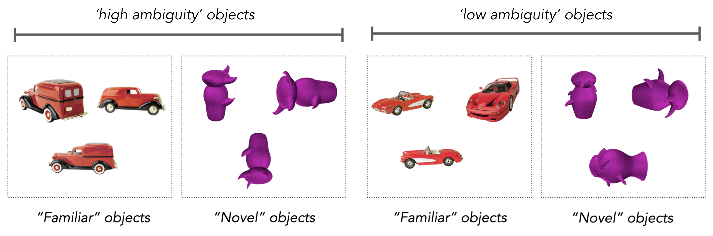

# zeroshot_objects

Zero-shot object discrimination dataset. All relevant stimuli for model evaluation can be download from [this folder](https://drive.google.com/drive/folders/1a-t2pockvcxYKfLaBGkR5kuNRsMOads5?usp=sharing). Images first used by [Barense et al. 2007](https://www.sciencedirect.com/science/article/pii/S0028393207002163). Initial results illustrating model failure by [Bonnen et al. 2021](https://www.cell.com/neuron/fulltext/S0896-6273(21)00459-1). Below is some information for how to organize images in this dataset.

Each trial contains one object presented from three different viewpoints (the 'typical') and another object, i.e., the 'oddity.' The task is to identify the oddity in each trial. For example: 


There are four conditions ('familiar_high' 'familiar_low' 'novel_high' and 'novel_low') and there were ~35 trials in each condition. Some background about the naming for each image, which is also context for the experiment and the relative difficult of each trial:

- 'low' trials: humans perform well, even without much time, and models perform well. 
- 'high' trials: humans perform well, but only with enough time, and models perform poorly
- 'familiar' trials: images of objects from semantically familiar categories, such as cars
- 'novel' trials: images of objects from purple, abstract-shaped objects people  

Here are some example stimuli from each condition: 



If you want to order the images in a way that's organized to reflect the experiment

```python 
import os
import numpy as np

# wherever the stimuli are
path_to_stimuli = '/path/to/image/folder/'

# get all the images in the dataset
stimuli = np.sort(os.listdir(path_to_stimuli))

# get the grouping of images presented to humans in each trial
trials = np.unique( [i[:i.find('_image')] for i in stimuli] )

# get a list of all images that are in each trial that humans saw
trial_images = {t:[i for i in stimuli if t in i] for t in trials}
```

Which you can use to load the images into whatever format you'll use, e.g., 

```python
image_dictionary = {} 

for i_trial in trial_images:
  
  image_dictionary[i_trial] = {} 

  for image_name in trial_images[i_trial]:
    
    # extract the essential parts of this image from the string 
    nicename = image_name[image_name.find('image'):-4]

    # load the image
    i_image = Image.open(os.path.join(path_to_stimuli, image_name))

    # convert image to numpy array and save to the dictionary
    image_dictionary[i_trial][nicename] = np.array(i_image)

```

Below we visualize the relationship between human and model performance on these stimuli. Performance of a standard computer vision model (e.g., resnet50 trained on imagenet) is plotted along the x axis, for each of the four conditions in this dataset ('high-ambiguity novel' objects, etc.). Human performance on these same conditions is plotted along the y axis, but with different experimental conditions in each plot.  

<b>Left</b>, we compare model and human performance, with people who have unlimited time (purple) or restricted time (green) to view these stimuli. Humans perform well on all of these conditions, when given enough time to view these stimuli (purple), significantly outperforming computer vision models on the 'high ambiguity' conditions. When people can only view these images briefly (e.g., less than 200ms), their performance is significantly worse (green) on these 'high ambiguity' conditions. Intrestingly, time-restricted human performance resembles the accuracy of standard computer vision models (i.e., on-diagnoal performance).

<b>Center</b>, we compare model and human performance with people who have unrestricted eye movements (purple) or can not move their eyes (green). These data resemble the same pattern as in the left panel, suggesting that time is important because it enables people to move their eyes---that is, it enables people to sequentially sample the visual stimulis as they encode the images. <b>Right</b>, we compare model and human performance, for people that have a specific neural structure intact (purple, grey) or have damage to that specific structure (green). These data suggest that this specific neural structure is necessary for these visual abilities.   


